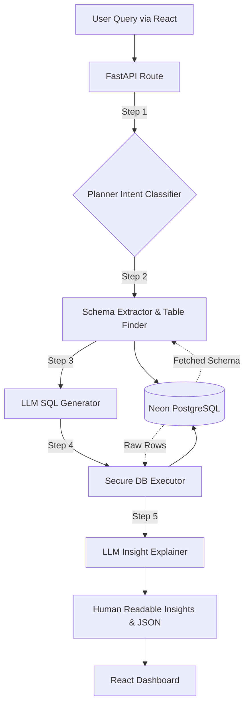

# Text-to-SQL Analytics Dashboard

## Overview
This application is an intelligent Text-to-SQL query pipeline with a fully-functional frontend dashboard. It empowers users to query their database using natural language. The system automatically categorizes intents, extracts real-time database schemas from Neon DB, uses an LLM to generate and validate exact PostgreSQL queries, and then translates the data results back into easy-to-understand insights.

## Live Website: 
The website is hosted at `https://code-for-purpose-2026.vercel.app/` with a mock data of electronic store.

## Features
- **Natural Language Querying**: Enter plain English queries and immediately get meaningful data.
- **Dynamic Schema Extraction**: Automatically retrieves real-time schema structures from Neon PostgreSQL databases.
- **Secure SQL Execution**: Automatically validates and blocks destructive commands before executing generated queries.
- **AI-Powered Insights**: Explains raw data returns in human-readable and contextual paragraphs.
- **Responsive Dashboard**: Clean interface built with React, Tailwind CSS, and shadcn/ui components.
- **Regex Query Optimization**: Performs a divide-and-conquer strategy using regex to intelligently identify exactly which database tables your agent should focus on.

## Tech Stack
- **Frontend**: React (Vite), Tailwind CSS, shadcn/ui (Lucide React icons)
- **Backend**: FastAPI, SQLAlchemy, Uvicorn
- **Database**: Neon (PostgreSQL)
- **AI Model**: Google Generative AI (Gemini)

## Project Structure

```plaintext
Code-for-Purpose-2026/
├── backend/
│   ├── core/
│   │   ├── database.py
│   │   ├── executor.py
│   │   ├── explainer_data.py
│   │   ├── get_sql_from_llm.py
│   │   ├── planner.py
│   │   ├── schema_extractor.py
│   │   └── table_finder.py
│   ├── data/
│   ├── models/
│   │   └── request_models.py
│   ├── routes/
│   │   └── query_routes.py
│   ├── tests/
│   │   ├── conftest.py
│   │   ├── test_executor.py
│   │   ├── test_explainer.py
│   │   ├── test_planner.py
│   │   ├── test_routes.py
│   │   ├── test_schema.py
│   │   └── test_sql_gen.py
│   ├── main.py
│   └── requirements.txt
├── frontend/
│   ├── src/
│   │   ├── components/
│   │   │   ├── ui/
│   │   │   ├── mode-toggle.tsx
│   │   │   └── theme-provider.tsx
│   │   ├── lib/
│   │   │   └── utils.ts
│   │   ├── App.tsx
│   │   ├── index.css
│   │   ├── main.tsx
│   │   └── vite-env.d.ts
│   ├── package.json
│   ├── tailwind.config.js
│   ├── tsconfig.json
│   └── vite.config.ts
├── vercel.json
├── .env.example
├── .gitignore
└── README.md
```

## Installation & Run Instructions

### 1. Prerequisites
- Python 3.10+
- Node.js & npm

### 2. Environment Setup
Create a `.env` file in the `backend/` directory starting with the `.env.example` file provided:
```bash
cp .env.example backend/.env
```
Populate the values inside `backend/.env` with your actual Neon database URL and Google API key.

### 3. Backend Setup
```bash
cd backend
python -m venv .venv
source .venv/bin/activate  # On Windows: .venv\Scripts\activate
pip install -r requirements.txt

# Start the Fast API server
uvicorn main:app --reload
```
The backend API will run on `http://127.0.0.1:8000`.

### 4. Frontend Setup
Open a new terminal window:
```bash
cd frontend
npm install

# Start the frontend dev server
npm run dev
```
The frontend will run on the local port specified by Vite (usually `http://localhost:5173`).

## Usage

> **Note**: The backend is hosted on a free Render instance, so it may take around a minute to spin up the server if it has been idle. Please be patient on your first query! Additionally, the app relies on Google Generative AI API keys, which are subject to standard usage/rate limits.

1. Open the frontend URL in your browser.
2. Enter a natural language query into the search bar (e.g., "Show me the top 5 users by purchase volume").
3. View the generated data table and the human-readable AI explanation.
4. Expand the "Query Details" accordion to view the raw generated SQL.

## Architecture



- **Frontend (React)**: Captures user input and renders tables/insights dynamically.
- **FastAPI / Backend**: Routes requests and coordinates logic via the pipeline.
- **Pipeline step 1 (Planner)**: Classifies user intent (e.g., analytical vs simple retrieval).
- **Pipeline step 2 (Schema Extractor)**: Grabs the live schema state from Neon and uses regex to narrow down required tables.
- **Pipeline step 3 (LLM Generator)**: Converts query + schema + intent into validated SQL.
- **Pipeline step 4 (Executor)**: Runs the query securely on Neon DB.
- **Pipeline step 5 (Explainer)**: Turns raw SQL row results into natural language summaries.

## Future Enhancements
- **Data Visualization**: Support dynamically plotting executed queries using Matplotlib injections or interactive frontend charting components.
- **Advanced Resilience & Caching**: Strengthen the pipeline by actively caching database queries and improving overarching error-handling mechanisms for scale.
- **Scalability and Deployment**: The current version can be dockerised and deployed on cloud platforms like AWS, Azure, or GCP with professional CI/CD pipelines.
